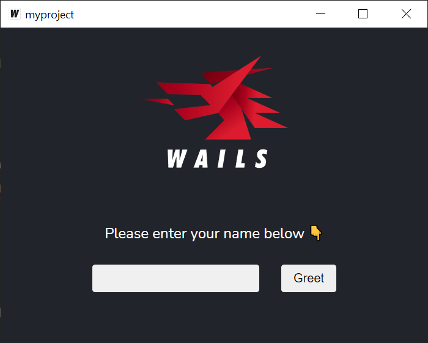

# Compiling your Project

From the project directory, run `wails build`.
This will compile your project and save the production-ready binary in the `build/bin` directory.

If you run the binary, you should see the default application:

For more details on compilation options, please refer to the [CLI Reference](../reference/cli.md#build).
